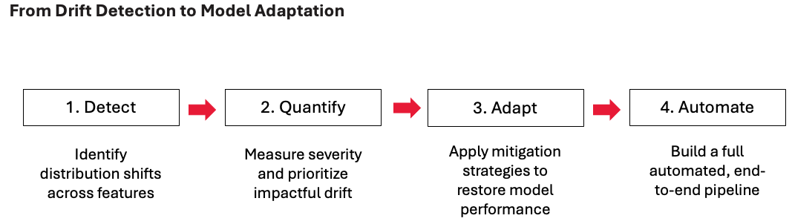
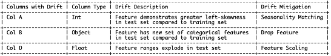
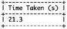
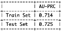
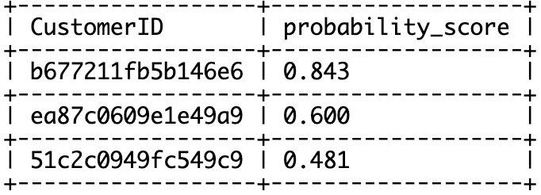
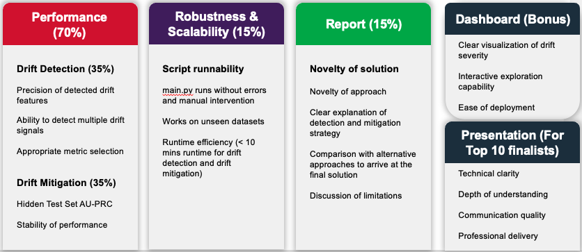

# 🏆 NAISC Singtel 2026: Guarding Model Integrity in a Shifting Data World

**📆 Challenge Period:** 6 March 2026 – 12PM, 17 April 2026  
**📆 Submission Deadline:** 12PM, 17 April 2026 (SGT)

Welcome to the **NAISC 2026 Adaptive Drift Intelligence Challenge**!

This repository contains the official challenge documents, public datasets, submission guidelines, and serves as the discussion forum for participants.

---

## 🎯 The Challenge

In a perfect world, data never changes.  
In the real world, user behavior shifts, sensors degrade, and environments evolve.

Your goal is to develop an **automated system** that:

- Detects data drift  
- Quantifies drift severity  
- Mitigates drift effectively  
- Maintains strong predictive performance  

All under a **Fixed Hyperparameter constraint**.



---

## 🚀 Getting Started

The public train and test datasets can be found in the `public_data/` directory.

Please use these datasets for development and validation. Final evaluation will be conducted on a hidden dataset that will not be provided to you.

Public dataset metadata:
| Column Name | Data Type | Sample Value |
| :--- | :--- | :--- |
| `CustomerID` | object | 1610a102a7854c5d |
| `UserGender` | object | Male |
| `UserAge` | int64 | 71 |
| `YoungAdultFlag` | object | No |
| `RetireeStatus` | object | Yes |
| `Married` | object | Yes |
| `Dependents` | object | Yes |
| `NumberofDependents` | int64 | 1 |
| `Country` | object | United States |
| `State` | object | California |
| `LocationCity` | object | Pine Valley |
| `AreaCode` | int64 | 91962 |
| `Latitude` | float64 | 32.800671 |
| `Longitude` | float64 | -116.483363 |
| `Population` | int64 | 1604 |
| `ReferredaFriend` | object | Yes |
| `NumberofReferrals` | int64 | 9 |
| `TenureinMonths` | int64 | 38 |
| `Offer` | object | Offer C |
| `VoiceService` | object | Yes |
| `AvgMonthlyLongDistanceCharges` | float64 | 28.3 |
| `AdditionalLines` | object | Yes |
| `ConnectivityType` | object | Yes |
| `InternetType` | object | Fiber Optic |
| `DataUsageAvg` | int64 | 27 |
| `CyberSecuritySvc` | object | No |
| `CloudStorageSvc` | object | Yes |
| `HardwareInsurance` | object | No |
| `PrioritySupport` | object | No |
| `VideoSvc_A` | object | Yes |
| `VideoSvc_B` | object | Yes |
| `AudioSvc` | object | No |
| `UnlimitedData` | object | Yes |
| `Contract` | object | One Year |
| `DigitalInvoicing` | object | No |
| `TransactionMode` | object | Bank Withdrawal |
| `MonthlyCharge` | float64 | 101.15 |
| `TotalCharges` | float64 | 3741.85 |
| `TotalRefunds` | float64 | 0.0 |
| `TotalExtraDataCharges` | int64 | 0 |
| `TotalLongDistanceCharges` | float64 | 1075.4 |
| `TotalRevenue` | float64 | 4817.25 |
| `CustomerLifetimeValue` | int64 | 4036 |
| `ChurnStatus` | object | No |
| `Month` | object | 25-Jan |

---

## 🛠️ Technical Constraints & Standardized Environment

To ensure a level playing field, we enforce a **Fixed Hyperparameter Rule**.

### Model Requirements
- Model: LightGBM (v4.6.0)
- Fixed Hyperparameters to set: 
   - verbosity: -1
   - objective: "binary"
   - is_unbalance: True
   - random_state: 42
   - importance_type : 'gain'

Participants are **not allowed** to modify the model’s internal hyperparameters (e.g., `n_estimators`, `max_depth`, `learning_rate`, etc.) and have to use all of the above hyperparameters when initialising the model.

### Runtime Environment
- Python v3.12
- CPU compute only (no GPU acceleration)

### Allowed
- Feature engineering
- Data selection (e.g., sliding windows)
- Sample weighting
- Data transformations
- Drift detection logic
- Automated retraining strategies

### Not Allowed
- Changing model hyperparameters
- Switching to a different model family
- Using GPU acceleration

Your innovation should focus on **drift detection and mitigation**, not model complexity.

---

## ⚙️ How We Will Run Your Solution

We will evaluate your solution as a **black-box pipeline** using the following commands:

```bash
pip install -r requirements.txt

python ./src/main.py --train_data_filepath <train_data_filepath> --test_data_filepath <test_data_filepath>
```
Your script must run end-to-end without any manual intervention.

---

### ✅ Expected Console Outputs

Your program should print the following information to the console:

1. **Data Drift Detection & Mitigation Summary**
   - Columns with detected drift  
   - Type of drift detected  
   - Mitigation methods applied  

2. **Runtime (in seconds)**
   - Time taken for drift detection and mitigation  

3. **Model Performance Metrics**
   - AU-PRC on training set
   - AU-PRC on test set after mitigation  

Example output format:

  
  


---

### 📄 Required Output File

In addition to the console outputs, your solution must generate a file of predicted test set probabilities named:

`prediction.csv`

This file must be created in the root directory and contain **exactly two columns**:

- CustomerID
- probability_score (Probability score from model prediction on test set)

Example format:



---

## 📊 Evaluation Criteria

Your submission will be evaluated based on:

- Drift Detection Accuracy (Hidden Data)
- Drift Mitigation Performance (Hidden Test Set)  
- Robustness & Scalability  
- Report Quality  
- Optional Dashboard (Bonus)  
- Presentation (Only needed for top 10 finalists during the Grand Finals)

Refer to the evaluation breakdown below for details:



---

## 💬 Discussion Forum & Support

We are using the **GitHub Discussions** tab as our official forum.

- 🙋 **Help Desk** — Technical questions and troubleshooting  
- 📢 **Announcements** — Official updates during the challenge  

Please check existing threads before opening a new discussion.

---

## 📤 Submission Requirements

To be eligible for judging you have to submit your solution by **12PM, 17 April 2026 (SGT)**:

How to submit:
1. Push your final solution to your team's private repo main branch
2. **Before the deadline** make a submission to the following microsoft form (https://forms.office.com/r/gwDZZQkTDG)
   - This form will collect your team name, GitHub repo link, final GitHub commit hash
   - If multiple submissions are received from a team, only the latest submission before the deadline will be considered for grading
3. After submitting your form, add cecilia.lin@singtel.com, yiting.jin@singtel.com and honzheng.low@singtel.com as collaborators to your team's private repo

Your private repo must be in the following structure and format:
```text
.
├── src/               # Solution source code
│   ├── main.py        # Main function to display solution's performance
|   ├── xxx.py         # Any other .py files that are created and used
├── notebooks/         # (Optional) Notebooks
│   ├── xxx.ipynb      # Any .ipynb files that want to be shared
├── prediction.csv     # File with trained model's predicted probability on the public test set post data drift detection and mitigation
├── model.joblib       # Model trained on public train set post data drift detection and mitigation
├── report.pdf         # PDF report of team's solution
├── .gitignore         # To exclude __pycache__ and CSVs
├── requirements.txt   # List of dependencies (pandas, sklearn, etc.)
└── README.md          # Main landing page explaining how to run your code (and optional dashboard). Specify your Team Name at the top of the README.md
```
---

Happy hacking! 💻✨